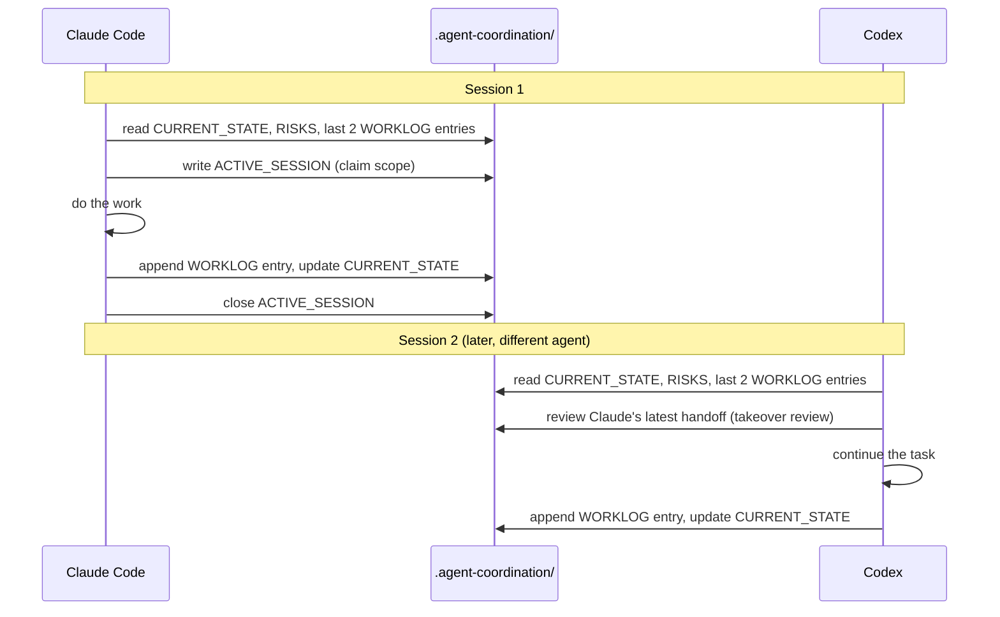
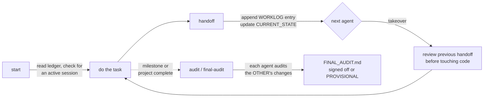

# 🤝 Agent Handoff & Audit

**Let Claude Code and OpenAI Codex work on the same repo, one at a time, without losing context or re-reading the whole conversation.**

This repo is a live sandbox for the [`agent-handoff-audit`](https://github.com/DavidMume/agent-handoff-audit-sandbox) skill: a shared coordination protocol that lets two different coding agents hand work back and forth through a small set of plain-text files instead of your chat history.

---

## The problem

You bounce between Claude Code and Codex on the same project. Each one starts cold:

- 🤷 No idea what the other agent just changed
- 🔁 Re-reads the whole codebase (and burns tokens) to get oriented
- 💥 Might edit the same files the other agent is mid-way through
- ✅ Claims "done" with no way for the other agent to verify it

## The fix

A tiny **shared ledger** — `.agent-coordination/` — that both agents read before working and update after working. No chat memory required.



---

## What gets created

```
your-project/
├── AGENTS.md              ← short pointer to the protocol (for Codex)
├── CLAUDE.md               ← same pointer (for Claude Code)
└── .agent-coordination/    ← gitignored by default — local, operational, not for publishing
    ├── ACTIVE_SESSION.md   ← who's working right now, on what, since when
    ├── CURRENT_STATE.md    ← replaceable snapshot: what's true about the project today
    ├── WORKLOG.md          ← append-only handoff log — never rewritten, never deleted
    ├── DECISIONS.md        ← durable decisions future agents must respect
    ├── RISKS.md             ← open risks, blockers, accepted trade-offs
    └── FINAL_AUDIT.md      ← reciprocal cross-agent audit findings + sign-off
```

`.agent-coordination/` stays out of git by default — it can contain operational or security findings that shouldn't end up in a public repo or a shipped bundle.

---

## The workflow



| Mode | What happens |
|---|---|
| `start` | Read the ledger's latest state, check nobody else is mid-task on the same files, begin work |
| `handoff` | Run checks, write **one** compact entry to `WORKLOG.md`, update `CURRENT_STATE.md`, close the session |
| `takeover` | Read the other agent's last handoff, verify its claims against the actual diff, then continue |
| `audit` | Focused independent review of the *other* agent's recent changes |
| `final-audit` | Full reciprocal audit at a milestone — each agent audits the other's work against a shared checklist (security, privacy, dependencies, accessibility, deployment, legal/compliance) |
| `status` | Summarize current state and open risks — read-only, no code touched |

### Invoking it

| | Codex | Claude Code |
|---|---|---|
| Start work | `$agent-handoff-audit start` | `/agent-handoff-audit start` |
| Take over | `$agent-handoff-audit takeover` | `/agent-handoff-audit takeover` |
| End of task | `$agent-handoff-audit handoff` | `/agent-handoff-audit handoff` |
| Cross-check | `$agent-handoff-audit audit` | `/agent-handoff-audit audit` |
| Milestone | `$agent-handoff-audit final-audit` | `/agent-handoff-audit final-audit` |
| Check state | `$agent-handoff-audit status` | `/agent-handoff-audit status` |

---

## Guardrails baked into the protocol

- 🔒 **No secrets, ever** — no tokens, passwords, keys, or personal data in the ledger
- 🚫 **No silent claims** — a test/build/deploy is only "passed" if it was actually run and observed
- ✍️ **Append-only worklog** — no agent rewrites or deletes another agent's entry
- 🚦 **One at a time** — if another session looks active on overlapping files, stop and report the collision instead of racing it
- 🙅 **No unauthorized side effects** — no commit, push, deploy, infra change, or new prod dependency unless the user or repo instructions say so
- ⚠️ **Honest severity** — a `final-audit` can't be marked fully approved while a `CRITICAL` or `HIGH` finding is open; single-agent audits are labeled `PROVISIONAL — SECOND AGENT REVIEW REQUIRED`

---

## Install it yourself

```bash
bash install.sh
# installs to ~/.local/share/agent-handoff-audit
# symlinks into ~/.claude/skills/ and ~/.agents/skills/

bash ~/.local/share/agent-handoff-audit/scripts/init-project.sh /path/to/your/repo
# creates .agent-coordination/, adds AGENTS.md / CLAUDE.md pointers,
# ignores .agent-coordination/ in .gitignore — all idempotent, nothing gets overwritten
```

