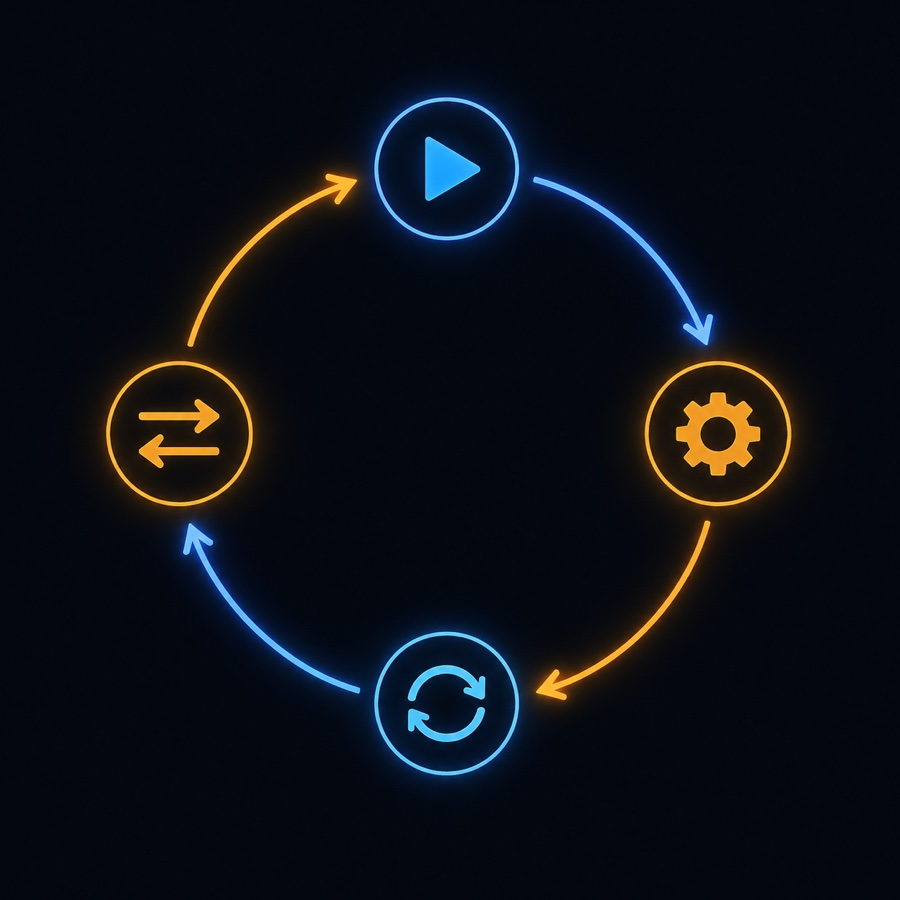
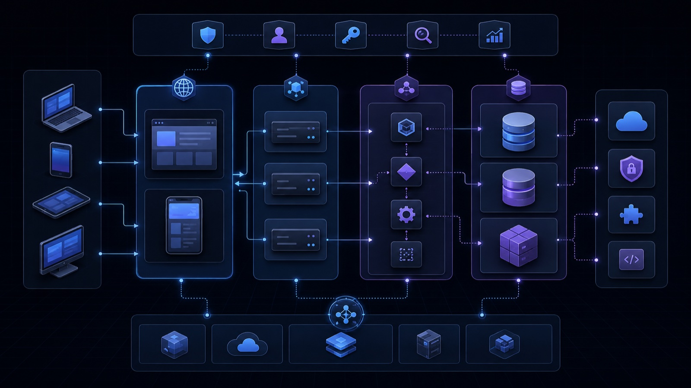
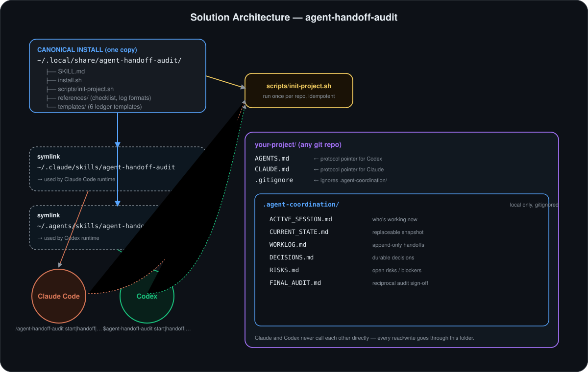

# 🤝 Agent Handoff & Audit

**Let Claude Code and OpenAI Codex work on the same repository, one at a time, without losing context or re-reading the whole conversation.**

- Works with: **Claude Code** and **OpenAI Codex CLI** (any other agent that can read a repo's instruction files can follow the same protocol)
- Platforms: macOS, Linux, and Windows via WSL (anywhere `bash` and `git` are available)
- Status: active, documented, tested — install and initializer scripts are exercised as part of every documentation update
- 📖 **[Full usage guide](docs/USAGE_GUIDE.md)** · ⚡ **[10-minute quickstart](docs/QUICKSTART.md)** · 🧯 **[Troubleshooting](docs/TROUBLESHOOTING.md)** · 🔒 **[Security](#security-and-privacy)** · 🧾 **[Examples](docs/examples/)** · 🇪🇸 **[Guía en español](docs/GUIA_DE_USO_ES.md)**

**English documentation** (this file and `docs/`) · **[Documentación en español](docs/GUIA_DE_USO_ES.md)**

New to skills, symlinks, or `AGENTS.md`? Every term is explained in plain language the first time it appears — see [Important concepts](#important-concepts).

---

## Table of contents

- [What problem does this solve?](#what-problem-does-this-solve)
- [How it works](#how-it-works)
- [Important concepts](#important-concepts)
- [Prerequisites](#prerequisites)
- [Quick install](#quick-install)
- [Step-by-step install](#step-by-step-install)
- [Preparing an existing project](#preparing-an-existing-project)
- [What each file does](#what-each-file-does)
- [Full tutorial: Claude starts, Codex continues](#full-tutorial-claude-starts-codex-continues)
- [Every mode explained](#every-mode-explained)
- [How this saves tokens](#how-this-saves-tokens)
- [Security and privacy](#security-and-privacy)
- [Uninstalling and updating](#uninstalling-and-updating)
- [Contributing](#contributing)

---

## What problem does this solve?

You bounce between Claude Code and Codex on the same project.

**Without coordination:**

1. Claude spends an afternoon building a login form, gets partway through, and the session ends.
2. Hours later — maybe a different day — you open Codex in the same repo and ask it to add "forgot password."
3. Codex has no memory of what Claude did. It re-reads files, guesses at intent, and either duplicates work or breaks something Claude already finished.
4. Nobody can say for certain whether the tests Claude "ran" actually passed, because that claim lived only in a chat window that Codex never saw.

**With this skill:**

1. Claude starts its session by reading a short shared summary (the **ledger**, explained below) instead of nothing.
2. Claude does the work, runs the tests, and before ending the session writes one compact entry describing what changed and what to do next — a **handoff**.
3. Codex opens the same repo later, reads that handoff, checks the actual diff to confirm the claims are true, and continues from the exact point Claude left off — no re-reading the whole chat.
4. When the feature is "done," each agent independently reviews the other's work (a **cross-audit**) instead of just trusting a self-report.

|                                            Without this skill | With this skill                                  |
| -------------------------------------------------------------: | ------------------------------------------------- |
|                              Each agent starts from zero        | Each agent reads a short summary first             |
|                              Context gets repeated or lost      | The ledger is reused instead of re-explained       |
|                              Agents can silently step on each other's changes | An active session is recorded before editing files |
|                              "It works" is taken on faith       | Commands and their actual results are recorded     |
|                              No independent verification        | Each agent audits the other's work                |

---

## How it works

```text
User assigns a task
        │
        ▼
Claude reads the ledger (CURRENT_STATE, RISKS, last 2 WORKLOG entries)
        │
        ▼
Claude records an active session
        │
        ▼
Claude works, runs tests, reviews its own diff
        │
        ▼
Claude writes one handoff entry and closes its session
        │
        ▼
Codex reads that handoff (takeover)
        │
        ▼
Codex verifies the claims, then continues the work
        │
        ▼
Both agents run a cross-audit at the milestone
```







---

## Important concepts

Short, plain-language definitions — skip anything you already know.

| Term | Meaning |
|---|---|
| **Skill** | A folder of instructions (`SKILL.md`) that tells an AI coding agent how to behave in a specific situation. Claude Code and Codex both support loading skills from a known folder. |
| **Repository (repo)** | A project folder tracked by Git, so every change to it has a history. |
| **Working tree** | The files on disk right now, as opposed to what's saved in Git's history. "Working tree clean" means nothing is changed since the last commit. |
| **Commit** | A saved snapshot of the repo at a point in time, with a message describing the change. |
| **Branch** | A named, independent line of commits — lets you work on something without touching the main line of history (`main`) until you're ready. |
| **Symlink (symbolic link)** | A pointer file that looks like a real file or folder but actually redirects to another location on disk. This project uses symlinks so Claude and Codex both point at one real copy of the skill instead of keeping two copies in sync by hand. |
| **Ledger / bitácora** | The set of plain-text files in `.agent-coordination/` that both agents read and write instead of talking to each other directly. |
| **Handoff** | The one compact note an agent writes at the end of a work session, describing what changed, what was verified, and what to do next. |
| **Takeover** | What an agent does when it picks up a task the other agent left: read the last handoff, check it against the real diff, then continue. |
| **Active session** | A record in `ACTIVE_SESSION.md` saying which agent is currently working and on which files, so the other agent doesn't start editing the same thing at the same time. |
| **Cross-audit** | One agent independently reviewing the other agent's recent changes — not just re-reading their notes, but checking the actual code. |
| **Final audit** | A full reciprocal review at a milestone: Claude audits everything attributed to Codex, and Codex audits everything attributed to Claude, using a shared checklist. |

---

## Prerequisites

| Requirement | Why | Required? |
|---|---|---|
| Git | Version control; this skill scaffolds files inside a Git repo | Required |
| A terminal (Terminal.app, iTerm, WSL, etc.) | To run the install and init scripts | Required |
| Bash | The install and init scripts are Bash scripts | Required (preinstalled on macOS/Linux; use WSL on Windows) |
| Claude Code | To use the `/agent-handoff-audit` side of the workflow | Optional — only if you use Claude |
| Codex CLI | To use the `$agent-handoff-audit` side of the workflow | Optional — only if you use Codex |
| Write permission in your home folder | The installer writes to `~/.local/share`, `~/.claude/skills`, `~/.agents/skills` | Required |

You do **not** need both Claude Code and Codex installed — the protocol works with just one agent (it still gives you the ledger and handoff discipline across your own sessions), and it's most useful with both.

Check what you have:

```bash
git --version
claude --version
codex --version
bash --version
```

If `claude` or `codex` prints "command not found," that agent simply isn't installed — see [Troubleshooting](docs/TROUBLESHOOTING.md#claude-command-not-found).

---

## Quick install

For readers already comfortable with the terminal:

```bash
git clone https://github.com/DavidMume/agent-handoff-audit-sandbox.git
cd agent-handoff-audit-sandbox
bash install.sh
```

Verify it landed in all three places:

```bash
ls -la ~/.local/share/agent-handoff-audit   # the one real copy of the skill
ls -la ~/.claude/skills/agent-handoff-audit  # symlink for Claude Code
ls -la ~/.agents/skills/agent-handoff-audit  # symlink for Codex
```

- The first command should show the skill's actual files: `SKILL.md`, `scripts/`, `templates/`, `references/`, `install.sh`.
- The second and third commands should each show a line starting with `l` (for "link") pointing at `~/.local/share/agent-handoff-audit`. That confirms Claude and Codex are both reading the *same* copy — there's nothing to keep in sync by hand.

If you don't need the walkthrough, skip to [Preparing an existing project](#preparing-an-existing-project). Otherwise, keep reading.

---

## Step-by-step install

A slower version of the same install, explained for a first time.

**1. Open a terminal.** On macOS: Spotlight → type "Terminal" → Enter. On Linux: your distro's terminal app. On Windows: open WSL.

**2. Choose a folder to clone into.** Anywhere you keep code works, e.g. your home folder:

```bash
cd ~
```

**3. Clone the repository** (download a copy of it with its full history):

```bash
git clone https://github.com/DavidMume/agent-handoff-audit-sandbox.git
```

**4. Enter the folder:**

```bash
cd agent-handoff-audit-sandbox
```

**5. (Optional) Read the installer before running it** — always reasonable before running a script from the internet:

```bash
cat install.sh
```

**6. Validate its syntax** without running it (catches typos, not behavior):

```bash
bash -n install.sh
```

No output means it's syntactically valid.

**7. Run the installer:**

```bash
bash install.sh
```

**8. Read the output.** You should see:

```text
Installed successfully.
Claude: /Users/you/.claude/skills/agent-handoff-audit
Codex:  /Users/you/.agents/skills/agent-handoff-audit

Initialize a repository with:
  bash "/Users/you/.local/share/agent-handoff-audit/scripts/init-project.sh" /path/to/repository
```

If a copy was already installed, the installer backs up the old one first — you'll see lines like `Backing up existing target: ... -> ....backup-20260803-194403` before the success message. Nothing is silently overwritten.

**9. Confirm the folders exist:**

```bash
ls -la ~/.local/share/agent-handoff-audit
ls -la ~/.claude/skills/agent-handoff-audit
ls -la ~/.agents/skills/agent-handoff-audit
```

**10. Restart Claude Code or Codex if either was already running**, so it picks up the new skill folder.

**11. Confirm the skill is visible.** In Claude Code, start a session in any repo and ask it to list available skills, or simply mention "agent-handoff-audit" — it should recognize the skill's description. In Codex, the skill becomes active once a repo's `AGENTS.md` points to it (see the next section).

---

## Preparing an existing project


Installing the skill once makes it available everywhere. Each individual project still needs to be **initialized** once — this creates its own ledger.

```bash
cd ~/Projects/my-project

bash ~/.local/share/agent-handoff-audit/scripts/init-project.sh .
```

This creates:

```text
.agent-coordination/
├── ACTIVE_SESSION.md
├── CURRENT_STATE.md
├── DECISIONS.md
├── FINAL_AUDIT.md
├── RISKS.md
└── WORKLOG.md
```

It also:

- **Appends a short block to `AGENTS.md`** (creating the file if it doesn't exist) telling Codex — and any other agent that reads `AGENTS.md` — to follow this protocol.
- **Appends the same block to `CLAUDE.md`** for Claude Code.
- **Adds `.agent-coordination/` to `.gitignore`** by default, so the ledger stays local to your machine.

**Why is `.agent-coordination/` ignored by default?** The ledger can end up containing operational detail — failing test output, security findings mid-fix, internal file paths — that you may not want in a public repo's history or in a shipped bundle. If you want the ledger tracked and shared through Git instead (useful for a private repo a team collaborates on), run:

```bash
bash ~/.local/share/agent-handoff-audit/scripts/init-project.sh . --tracked
```

`--tracked` skips the `.gitignore` step; everything else is identical.

**Running it a second time is safe.** The script is **idempotent** — running it twice produces the same result as running it once, with no duplicated content. If a coordination file already exists, it's left untouched (`Kept existing ...`); if `AGENTS.md`/`CLAUDE.md` already contain the instruction block, it's not added again (`Instruction already present in ...`); if `.gitignore` already ignores the ledger, nothing is appended. You'll never end up with two copies of the same block.

---

## What each file does

| File | Purpose | Who updates it | When it's read |
|---|---|---|---|
| `CURRENT_STATE.md` | Short, replaceable snapshot of the project right now | The last agent to finish a task | At the start of every session |
| `WORKLOG.md` | Append-only history of every handoff | Both agents, always by appending | When resuming or reviewing past work |
| `ACTIVE_SESSION.md` | Which agent is working, since when, on what scope | The agent currently working | Before editing any file |
| `DECISIONS.md` | Durable decisions a future agent must not silently reverse | Either agent, when a decision matters long-term | When a change might contradict a past decision |
| `RISKS.md` | Open risks, blockers, and explicitly accepted risks | Either agent | Before and after doing work |
| `FINAL_AUDIT.md` | Reciprocal audit findings and sign-off at a milestone | Both agents | When a phase or project is presented as complete |

**Append-only** means new entries are always added to the end of the file — never edited or deleted. `WORKLOG.md` is append-only so that no agent can quietly rewrite history to make a past handoff look better after the fact; the full, honest sequence of events stays intact.

See a filled-in example of each file in [`docs/examples/`](docs/examples/).

---

## Full tutorial: Claude starts, Codex continues

**Scenario:** Claude needs to build a login form. Later, Codex needs to review that work and add password recovery.

### Claude starts

In your Claude Code conversation, in the project you already initialized:

```text
/agent-handoff-audit start
```

Claude reads, in order: `AGENTS.md`/`CLAUDE.md`, `CURRENT_STATE.md`, open items in `RISKS.md`, the newest relevant entries in `DECISIONS.md`, and the last two `WORKLOG.md` entries. It then records itself as the active agent, the branch and starting commit, and the intended scope in `ACTIVE_SESSION.md`.

### Claude works

Claude implements the login form, runs the project's tests, and reviews its own diff before finishing — same as any other task, just with the ledger open alongside it.

### Claude hands off

```text
/agent-handoff-audit handoff
```

A trimmed `WORKLOG.md` entry might look like:

```markdown
## 2026-08-03T16:40:00-05:00 — Claude — COMPLETE

- Task: Build login form
- Files changed:
  - `src/components/LoginForm.tsx`: new form with email/password fields and client-side validation
- Verification:
  - `npm test -- login` — PASSED
- Risks / unresolved: none
- Next agent:
  - Add password recovery flow; no auth backend changes were made
```

(Full example: [`docs/examples/handoff-example.md`](docs/examples/handoff-example.md).)

### Codex continues

In your Codex CLI session, in the same repo:

```text
$agent-handoff-audit takeover
```

Codex reads Claude's latest handoff, opens the actual diff/commit it references, confirms the claimed test run is plausible against what's in the repo, checks for obvious problems (missing error states, accessibility gaps, anything the handoff didn't mention), and only then starts adding password recovery — without reading the entire prior conversation.

### Codex hands off

```text
$agent-handoff-audit handoff
```

Same shape as Claude's handoff: files changed, checks run, decisions, risks, and the exact next recommended action — ready for whoever opens the repo next, human or agent.

---

## Every mode explained

### `start`

- **When:** at the beginning of a substantial task.
- **Reads:** repo instructions, `CURRENT_STATE.md`, open `RISKS.md` items, recent `DECISIONS.md`, last two `WORKLOG.md` entries, then only the specific files/commits those reference.
- **Records:** agent identity, timestamp, branch, starting commit, task, and intended file scope in `ACTIVE_SESSION.md`.
- **Don't use it for:** a one-off question that touches no files.
- Claude: `/agent-handoff-audit start` · Codex: `$agent-handoff-audit start`

### `takeover`

- **When:** you're picking up work the *other* agent left, not continuing your own still-open session.
- **How:** reads the other agent's last relevant `WORKLOG.md` entry, opens the diff or commit it references, and checks the claimed checks/results against what's actually in the repo before touching anything.
- **If it finds a problem:** it records the finding (without blame) and, if unresolved, opens an entry in `RISKS.md` — then fixes what's in scope.
- Claude: `/agent-handoff-audit takeover` · Codex: `$agent-handoff-audit takeover`

### `handoff`

- **Run first:** review the actual diff, remove accidental/unrelated changes, and run the relevant checks (tests, lint, build, or a focused manual check).
- **Records:** one structured `WORKLOG.md` entry — files changed, behavior implemented, checks with real outcomes, decisions, unresolved risks, and the exact next recommended action.
- **Never:** paste full logs or full diffs into the ledger — reference file paths and commit hashes instead.
- **Always:** close `ACTIVE_SESSION.md` before finishing — don't leave a session looking active after you've stopped.
- Claude: `/agent-handoff-audit handoff` · Codex: `$agent-handoff-audit handoff`

### `status`

Read-only. Summarizes `CURRENT_STATE.md`, open risks, and the last relevant handoff — no code or ledger file is touched.
Claude: `/agent-handoff-audit status` · Codex: `$agent-handoff-audit status`

### `audit`

A focused, independent review of specifically the *other* agent's recent changes — smaller in scope than a `final-audit`, useful mid-project when you want a second opinion without running the full checklist.
Claude: `/agent-handoff-audit audit` · Codex: `$agent-handoff-audit audit`

### `final-audit`

Run at a milestone or when a project is presented as complete:

- Claude independently audits the changes attributed to Codex; Codex independently audits the changes attributed to Claude.
- **The author of a fix is never its only verifier** — the other agent must confirm a finding is actually closed, not just that code changed.
- A **single-agent audit is provisional** and must be labeled `PROVISIONAL — SECOND AGENT REVIEW REQUIRED`.
- **No project may be marked fully approved while a `CRITICAL` or `HIGH` finding is still open.**

```text
/agent-handoff-audit final-audit      (Claude)
$agent-handoff-audit final-audit      (Codex)
```

---

## How this saves tokens

The next agent should **not** read: the whole chat, the whole repository history, every log, all of `WORKLOG.md`, or every file in the project.

It should read, in this order, and stop as soon as it has enough:

1. Repository instructions (`AGENTS.md`, `CLAUDE.md`).
2. `CURRENT_STATE.md`.
3. Open items in `RISKS.md`.
4. Recent, relevant entries in `DECISIONS.md`.
5. Only the last two entries in `WORKLOG.md`.
6. Only the specific files those entries mention.

This reduces repeated context — a new session doesn't have to reconstruct the whole project state from scratch. It does not guarantee any specific amount of savings; that depends on the project and how much the agent still needs to inspect directly.

---

## Security and privacy

**Never write any of the following to the ledger:**

passwords · API keys · tokens · private keys · cookies/session identifiers · personal data · medical records · financial data · data about children · real production records · full error output that contains secrets · an agent's private reasoning

**If a secret ends up in the ledger anyway:**

1. Stop working — don't add more changes on top.
2. Don't push. If it's already local-only (the default, since `.agent-coordination/` is gitignored), it hasn't left your machine.
3. Rotate or revoke the exposed secret immediately, regardless of whether it was pushed.
4. Remove the secret from the file.
5. If it was committed or pushed, check Git history for it — a plain edit isn't enough, since Git keeps prior versions.
6. Record that an incident happened in `RISKS.md` **without copying the secret itself** into that record either.

**This skill's audits are not a substitute for:** penetration testing, professional security review, legal advice, a formal privacy assessment, or a compliance audit. Treat `final-audit` findings as a structured starting point, not a certification.

Full detail: [Security in the usage guide](docs/USAGE_GUIDE.md#security-and-privacy-in-depth).

---

## Uninstalling and updating

**Before removing anything, confirm what you're looking at** — both install targets are symlinks, not real copies:

```bash
ls -la ~/.claude/skills/agent-handoff-audit
ls -la ~/.agents/skills/agent-handoff-audit
```

A line starting with `l` and an arrow (`-> /Users/you/.local/share/agent-handoff-audit`) confirms it's a symlink, safe to remove without touching the real files:

```bash
rm ~/.claude/skills/agent-handoff-audit
rm ~/.agents/skills/agent-handoff-audit
```

The real copy lives at `~/.local/share/agent-handoff-audit`. Removing it is a separate, less reversible step — see the guarded walkthrough in [Uninstalling in the usage guide](docs/USAGE_GUIDE.md#uninstalling) before running anything there.

**Updating:**

```bash
cd /path/to/agent-handoff-audit-sandbox
git pull --ff-only
bash install.sh
```

Re-running `install.sh` backs up the previous install (timestamped, e.g. `agent-handoff-audit.backup-20260803-194403`) before replacing it — nothing is silently overwritten. See [Updating](docs/USAGE_GUIDE.md#updating) for where those backups land and how to remove them once you've confirmed the update is good.

---

## Contributing

Issues and pull requests are welcome. Before opening a PR:

- Run `bash tests/check.sh` for shell syntax checks plus the complete isolated smoke test.
- Use `bash tests/smoke-test.sh` directly when you only need to exercise installation, reinstall backups, symlinks, local/tracked initialization, and idempotency.
- Keep documentation in sync with actual script behavior — this repo intentionally avoids documenting commands or files that don't exist yet.
